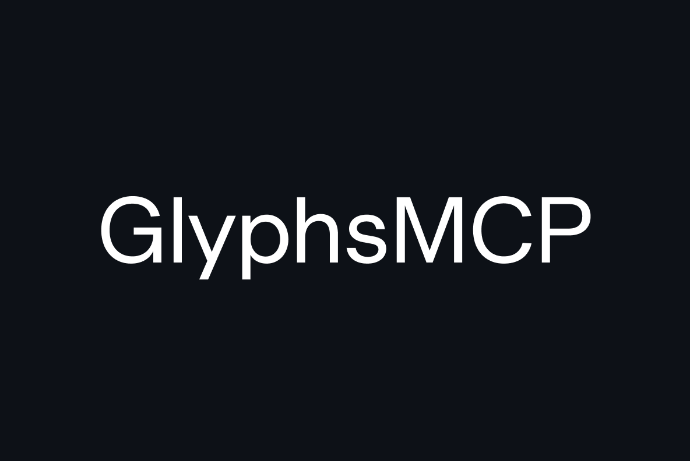

<p align="center">
  
</p>

MCP bridge for AI-assisted type design in [GlyphsApp](https://glyphsapp.com).

Lets Claude, Cursor, or any MCP client read and write font data directly in GlyphsApp — bidirectional, real-time, live in the editor.

```
MCP Client  ←(stdio/MCP)→  MCP Server  ←(HTTP/localhost)→  GlyphsApp Plugin
```

## Requirements

- [GlyphsApp 3](https://glyphsapp.com) (tested on 3.2+)
- An MCP client: [Claude Code](https://docs.anthropic.com/en/docs/claude-code), [Cursor](https://cursor.sh), [Windsurf](https://windsurf.com), etc.
- Python 3.10+ with [uv](https://docs.astral.sh/uv/) (recommended) or pip

## Installation

### 1. Install the GlyphsApp plugin

Download **GlyphsMCP.glyphsPlugin.zip** from the [latest release](https://github.com/nmassi/glyphs-mcp/releases/latest), unzip, and double-click to install.

Restart GlyphsApp. You should see a **GlyphsMCP** menu in the menu bar.

### 2. Connect your MCP client

**Claude Code:**

```bash
claude mcp add glyphs-mcp -- uvx glyphs-mcp
```

**Cursor / VS Code** — add to your MCP config:

```json
{
  "mcpServers": {
    "glyphs-mcp": {
      "command": "uvx",
      "args": ["glyphs-mcp"]
    }
  }
}
```

That's it.

### 3. Use it

Open a font in GlyphsApp, then ask your AI assistant:

> "Run a full color audit on my font and tell me which glyphs are inconsistent"

> "Compare the stems across all my lowercase letters"

> "Check if my figures are consistent with my letters"

> "Make the R 20% wider and harmonize the curves"

## Tools

### Read

| Tool            | Description                                                              |
| --------------- | ------------------------------------------------------------------------ |
| `get_font_info` | Font family name, UPM, glyph count, masters, axes, metrics, instances    |
| `list_glyphs`   | All glyph names with unicode, category, layer count                      |
| `get_glyph`     | Full glyph data: paths, components, anchors, sidebearings for all layers |
| `get_glyph_svg` | Glyph rendered as SVG markup                                             |
| `get_selection` | Current editor selection: active glyph, layer, selected paths/nodes      |
| `get_masters`   | All masters with metrics and axis positions                              |
| `get_kerning`   | All kerning pairs for a master                                           |
| `get_features`  | OpenType feature code                                                    |

### Write

| Tool                  | Description                                                        |
| --------------------- | ------------------------------------------------------------------ |
| `create_glyph`        | Create a new glyph with optional width, unicode, and initial paths |
| `set_glyph_paths`     | Replace all paths on a glyph's layer                               |
| `set_glyph_width`     | Set advance width                                                  |
| `set_glyph_color`     | Set color label (0-11)                                             |
| `set_glyph_unicode`   | Assign or clear a unicode value                                    |
| `rename_glyph`        | Rename a glyph                                                     |
| `duplicate_glyph`     | Copy a glyph with all layers to a new name                         |
| `delete_glyph`        | Delete a glyph                                                     |
| `set_kerning_pair`    | Add or modify a kerning pair                                       |
| `delete_kerning_pair` | Remove a kerning pair                                              |
| `set_feature_code`    | Create or update an OpenType feature                               |

### Analysis

| Tool                     | Description                                             |
| ------------------------ | ------------------------------------------------------- |
| `measure_stems`          | Measure stem thicknesses via perpendicular ray-casting  |
| `compare_stems`          | Compare stems across glyphs using industry patterns     |
| `get_stem_targets`       | Designer's intended stem values from Dimensions palette |
| `measure_color`          | Measure ink density for a single glyph                  |
| `compare_color`          | Compare ink density across glyphs                       |
| `audit_font_color`       | Full font color audit across all letters                |
| `check_overshoots`       | Overshoot consistency at baseline, x-height, cap-height |
| `compare_proportions`    | Width ratios, related-form groups, ordering constraints |
| `check_diagonal_weights` | Diagonal stem thickness vs straight reference           |
| `check_junctions`        | Stem thinning at arch/bowl junctions                    |
| `check_related_forms`    | Cross-validate figures and letters (0/O, 6/9, 8/S, 3/B) |
| `check_punctuation`      | Mirrored pair widths, dash ratios, related punctuation  |

Analysis tools automatically mark glyphs in GlyphsApp: **red** = inconsistent, **orange** = unreliable, **yellow** = optical compensation, **green** = pass.

### RMX Tools

Requires [RMX Tools](https://remix-tools.com/glyphsapp) for full functionality. Falls back to native transforms when RMX is unavailable.

| Tool            | Description                                         |
| --------------- | --------------------------------------------------- |
| `rmx_harmonize` | Optimize bezier curves                              |
| `rmx_scale`     | Scale by percentage with stroke weight compensation |
| `rmx_tune`      | Adjust weight, width, height, or slant              |
| `rmx_monospace` | Adjust a glyph to a fixed advance width             |
| `rmx_batch`     | Apply any RMX filter to multiple glyphs             |

### Advanced

| Tool                | Description                                                 |
| ------------------- | ----------------------------------------------------------- |
| `execute_in_glyphs` | Run arbitrary Python inside GlyphsApp (disabled by default) |

## Multi-master support

All tools accept an optional `master_id` parameter. When omitted, read/write tools use the first master. Analysis tools analyze all masters and return per-master results.

## Menu

The plugin adds a **GlyphsMCP** menu to the menu bar:

- **Start/Stop Server** — toggle the HTTP server
- **Allow Execute Endpoint** — enable `execute_in_glyphs` (off by default for security)

## Preferences

| Key                          | Default | Description                      |
| ---------------------------- | ------- | -------------------------------- |
| `com.glyphsmcp.port`         | `7745`  | HTTP server port                 |
| `com.glyphsmcp.autostart`    | `true`  | Start server on GlyphsApp launch |
| `com.glyphsmcp.allowExecute` | `false` | Enable the execute endpoint      |

## How it works

The GlyphsApp plugin runs an HTTP server on `127.0.0.1:7745` inside GlyphsApp. All GlyphsApp API calls run on the main thread via a queue + NSTimer bridge for thread safety.

The MCP server is a thin translation layer — it receives MCP tool calls via stdio and forwards them as HTTP requests to the plugin.

## Roadmap

- **Kerning analysis** — Multi-master kerning consistency checks, inspired by [Kern On](https://kern-on.com/manual/)
- **Auto-update** — Check for updates directly from the GlyphsMCP menu
- **Analytics** — Optional usage telemetry to guide development priorities

## License

MIT — Nicolas Massi
www.nico.works
