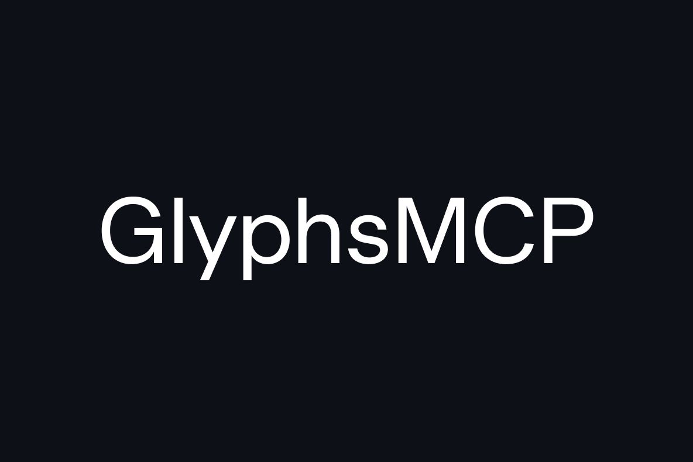

<p align="center">
  
</p>

MCP bridge for AI-assisted type design in [GlyphsApp](https://glyphsapp.com).

Lets Claude, Cursor, or any MCP client read and write font data directly in GlyphsApp — bidirectional, real-time, live in the editor.

```
MCP Client  ←(stdio/MCP)→  MCP Server  ←(HTTP/localhost)→  GlyphsApp Plugin
```

## Requirements

- [GlyphsApp 3](https://glyphsapp.com) (tested on 3.2+)
- An MCP client: [Claude Code](https://docs.anthropic.com/en/docs/claude-code), [Cursor](https://cursor.sh), [Windsurf](https://windsurf.com), etc.
- Python 3.10+ with [uv](https://docs.astral.sh/uv/) (recommended) or pip
- `glyphsets` and `shaperglot` (installed automatically with the MCP package)

## Installation

### 1. Install the GlyphsApp plugin

**From Plugin Manager (recommended):** Open GlyphsApp, go to _Window > Plugin Manager_, search for **MCP**, and click Install.

**Manual install:** Download **GlyphsMCP.glyphsPlugin.zip** from the [latest release](https://github.com/nmassi/glyphs-mcp/releases/latest), unzip, and double-click to install.

Restart GlyphsApp. You should see **GlyphsMCP** under the _Window_ menu.

### 2. Connect your MCP client

**Claude Code:**

```bash
claude mcp add glyphs-mcp -- uvx glyphs-mcp
```

**Cursor / VS Code** — add to your MCP config:

```json
{
  "mcpServers": {
    "glyphs-mcp": {
      "command": "uvx",
      "args": ["glyphs-mcp"]
    }
  }
}
```

That's it.

### 3. Use it

Open a font in GlyphsApp, then ask your AI assistant:

> "Run a full color audit on my font and tell me which glyphs are inconsistent"

> "Compare the stems across all my lowercase letters"

> "Check if my figures are consistent with my letters"

> "Make the R 20% wider and harmonize the curves"

> "Analize metrics on lowercases"

## Tools

### Read

| Tool            | Description                                                              |
| --------------- | ------------------------------------------------------------------------ |
| `get_font_info` | Font family name, UPM, glyph count, masters, axes, metrics, instances    |
| `list_glyphs`   | Glyph metadata, optionally filtered by `category` and capped by `limit`  |
| `get_glyph`     | Full glyph data: paths, components, anchors, sidebearings for all layers |
| `get_glyph_svg` | Glyph rendered as SVG markup                                             |
| `get_selection` | Current editor selection: active glyph, layer, selected paths/nodes      |
| `get_masters`   | All masters with metrics and axis positions                              |
| `get_kerning`   | Kerning pairs filtered by `master_id`/`left`, optionally capped by `limit` |
| `get_features`  | OpenType feature code                                                    |

### Write

| Tool                  | Description                                                        |
| --------------------- | ------------------------------------------------------------------ |
| `create_glyph`        | Create a new glyph with optional width, unicode, and initial paths |
| `set_glyph_paths`     | Replace all paths on a glyph's layer                               |
| `set_glyph_width`     | Set advance width                                                  |
| `set_glyph_color`     | Set color label (0-11)                                             |
| `set_glyph_unicode`   | Assign or clear a unicode value                                    |
| `rename_glyph`        | Rename a glyph                                                     |
| `duplicate_glyph`     | Copy a glyph with all layers to a new name                         |
| `delete_glyph`        | Delete a glyph                                                     |
| `set_kerning_pair`    | Add or modify a kerning pair                                       |
| `delete_kerning_pair` | Remove a kerning pair                                              |
| `set_feature_code`    | Create or update an OpenType feature                               |
| `generate_box_drawing`| Generate U+2500–U+259F outlines across masters; can overwrite drawings |

### Analysis

| Tool                     | Description                                             |
| ------------------------ | ------------------------------------------------------- |
| `measure_stems`          | Measure stem thicknesses via perpendicular ray-casting  |
| `compare_stems`          | Compare stems across glyphs using industry patterns     |
| `get_stem_targets`       | Designer's intended stem values from Dimensions palette |
| `measure_color`          | Measure ink density for a single glyph                  |
| `compare_color`          | Compare ink density across glyphs                       |
| `audit_font_color`       | Full font color audit across all letters                |
| `check_overshoots`       | Overshoot consistency at baseline, x-height, cap-height |
| `compare_proportions`    | Width ratios, related-form groups, ordering constraints |
| `check_diagonal_weights` | Diagonal stem thickness vs straight reference           |
| `check_junctions`        | Stem thinning at arch/bowl junctions                    |
| `check_related_forms`    | Cross-validate figures and letters (0/O, 6/9, 8/S, 3/B) |
| `check_punctuation`      | Mirrored pair widths, dash ratios, related punctuation  |
| `check_compatibility`    | Master compatibility: paths, nodes, components, anchors |
| `analyze_kerning`        | Kerning quality: cross-master gaps, orphans, outliers   |
| `analyze_spacing`        | Spacing quality: sidebearing groups, symmetry, drift    |
| `analyze_kerning_groups` | Analyze or assign kerning groups, with dry-run/overwrite control |
| `auto_kern`              | Preview or apply optical-area kerning to critical, automatic, or explicit pairs |
| `check_glyphset_coverage`| Check Google Fonts glyphsets and optionally add missing empty glyphs |
| `check_language_support` | Export a temporary instance and evaluate language support with Shaperglot |
| `review_production`      | Run a 44-item production-readiness review              |
| `check_font_name`        | Screen a proposed family name against Fontdata; not legal clearance |

Analysis tools may mark glyphs in GlyphsApp: **red** = inconsistent, **orange** = unreliable, **yellow** = warning/optical compensation, **green** = pass. `analyze_kerning`, `analyze_spacing`, `check_compatibility`, and `compare_stems` also point to matching workflow recipes for broader checks.

### RMX Tools

Requires RMX Tools for full functionality. `rmx_scale` now uses real RMX processing, accepts one value or a per-master list for scale parameters, and defaults `allow_fallback=False`; native affine fallback must be explicitly enabled. `rmx_tune` delegates to the loaded RMX Tuner and supports `blend` and `all_masters`.

| Tool            | Description                                         |
| --------------- | --------------------------------------------------- |
| `rmx_harmonize` | Optimize bezier curves                              |
| `rmx_scale`     | Scale by percentage with stroke weight compensation |
| `rmx_tune`      | Adjust weight, width, height, or slant              |
| `rmx_monospace` | Adjust a glyph to a fixed advance width             |
| `rmx_batch`     | Apply any RMX filter to multiple glyphs             |
| `smart_scale`   | Scale multiple glyphs with measured stem compensation, optional backups |

### Recipes

Bundled markdown recipes provide ordered workflows for consistency audits, spacing, kerning, master compatibility, proportional scaling, dated-layer cleanup, and Glyphs plugin creation.

| Tool              | Description                                      |
| ----------------- | ------------------------------------------------ |
| `list_recipes`    | List bundled and user-created recipes            |
| `get_recipe`      | Read a complete recipe                           |
| `get_recipe_step` | Read one numbered step with its next-step directive |
| `create_recipe`   | Write a recipe markdown file; overwrite is opt-in |
| `delete_recipe`   | Permanently delete a recipe markdown file        |

Recipe creation and deletion modify files in the installed plugin's `Resources/recipes` directory.

### Advanced

| Tool                | Description                                                 |
| ------------------- | ----------------------------------------------------------- |
| `execute_in_glyphs` | Run arbitrary Python inside GlyphsApp (disabled by default) |

## Multi-master support

All tools accept an optional `master_id` parameter. When omitted, read/write tools use the first master. Analysis tools analyze all masters and return per-master results.

Tools with side effects are explicit: kerning-group analysis can assign groups and color glyphs; auto-kern can write kerning; glyphset coverage can add empty blue-labelled glyphs; box drawing creates or replaces outlines; smart scale modifies outlines and can create backup layers; recipe CRUD writes or deletes markdown files. Use dry-run/preview options where available and save the font before bulk operations.

## Menu

The plugin adds a **GlyphsMCP** submenu under _Window_ in the menu bar:

- **Start/Stop Server** — toggle the HTTP server
- **Connect** — copy ready-to-paste MCP config for Claude Code or VS Code (and forks)
- **Documentation** — open this page in your browser
- **Allow Execute Endpoint** — enable `execute_in_glyphs` (off by default for security)

## Preferences

| Key                                | Default | Description                      |
| ---------------------------------- | ------- | -------------------------------- |
| `com.nico.glyphs-mcp.port`         | `7745`  | HTTP server port                 |
| `com.nico.glyphs-mcp.autostart`    | `true`  | Start server on GlyphsApp launch |
| `com.nico.glyphs-mcp.allowExecute` | `false` | Enable the execute endpoint      |

## How it works

The GlyphsApp plugin runs an HTTP server on `127.0.0.1:7745` inside GlyphsApp. All GlyphsApp API calls run on the main thread via a queue + NSTimer bridge for thread safety.

The MCP server is a thin translation layer — it receives MCP tool calls via stdio and forwards them as HTTP requests to the plugin.

## Roadmap

- **Font proofing** — Generate proof strings for spacing/kerning evaluation
- **Auto-update** — Check for updates directly from the GlyphsMCP menu
- **Analytics** — Optional usage telemetry to guide development priorities

## License

MIT — Nicolas Massi
www.nico.works
